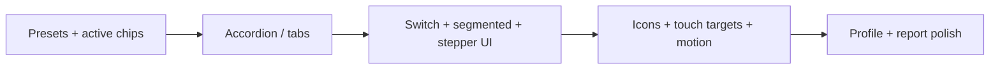

# Accessibility Widget – UX/UI Improvement Guide

This document captures recommended improvements to the Clearweb accessibility widget’s user experience and interface. It is based on a review of the current implementation (`accessibility-widget.js`, `frontend.css`) and common patterns from accessibility overlay products and WCAG guidance.

The widget is functionally strong, but the UI still reads like a **long settings form** rather than a **guided accessibility tool**. The suggestions below are ordered by impact and grouped by theme.

---

## Current state (baseline)

| Aspect | Today |
|--------|--------|
| Layout | Fixed 320px panel, 8 flat sections, 40+ controls in one scroll column |
| Controls | Uniform text buttons in a 2-column grid (`.cwas-ctrl-btn`) |
| Patterns | Toggles, exclusive modes, and steppers look the same |
| Trigger | Circular FAB, generic person SVG, scale on hover |
| Profiles | `window.prompt()` for naming; list in panel footer area |
| Feedback | Small step values in button subtitles; limited live announcements |

---

## 1. Information architecture (highest impact)

**Problem:** Eight always-open sections and dozens of controls create **choice overload** and make it hard to see what is already active.

| Approach | Why it helps |
|----------|----------------|
| **Collapsible sections** (`<details>` / accordion) | Keeps power features without a mile of scroll; users open only “Reading” or “Color” when needed. |
| **Tabbed or segmented top nav** | e.g. Text · Vision · Reading · More — matches mental models better than eight uppercase section labels. |
| **“Quick start” presets** at the top | One-tap bundles: *Low vision*, *Dyslexia*, *Reduce motion*, *High contrast* — discoverable without using `prompt()` or digging into Profiles. |
| **Active settings strip** | Chips under the title: `Text 120% · Night mode · Reading mask` — tap to clear one; answers “what did I turn on?” |

**Note:** Named profiles already exist in `localStorage`; surfacing **preset bundles in the main UI** aligns UX with that capability.

---

## 2. Control patterns (clarity and predictability)

**Problem:** Toggles, exclusive modes, and steppers all use the same button grid — users cannot tell *toggle* vs *pick one of three* vs *cycle value*.

### Recommended control mapping

| Feature type | Current | Recommended |
|--------------|---------|-------------|
| Binary on/off | Text button + `aria-pressed` | **Switch** (`role="switch"`, visible on/off track) |
| One-of-many (contrast, saturation, CVD) | Toggle buttons, deselect on second click | **Segmented control** (radio group, `aria-checked`) |
| Stepped values (text size, spacing) | Single button cycles value | **+ / − row** with central value and `aria-live` |
| Font scale down | Separate one-off button | Same stepper component as increase |

### Typography stepper example

```
[ − ]   Line height   ×1.4   [ + ]
```

One `aria-live` region announces changes — clearer than “tap Increase text until the small subtitle changes.”

### Sliders (optional)

`input[type="range"]` for font scale and line height can be faster for some users and easier to understand than cyclic buttons. Pair with numeric label and keyboard support.

### Mode groups

Use `aria-describedby` on groups explaining mutual exclusivity, e.g. “Only one contrast mode at a time.”

---

## 3. Visual design and branding

**Problem:** Text-only cells, small type (11–12px in places), non-standard trigger icon, panel may stay light while the page is in night/contrast mode.

| Improvement | Detail |
|-------------|--------|
| **Icon + label** on controls | SVG with `aria-hidden`; label always visible — helps scanning and Hebrew/RTL where labels wrap. |
| **Recognizable trigger** | Universal accessibility symbol or clear “accessibility” affordance; optional **badge** when any setting is active. |
| **Spacing scale** | 16px section padding, 12px control gap, **44px minimum touch targets** (WCAG 2.5.5). |
| **Motion** | Subtle panel enter/exit; honor `prefers-reduced-motion` and widget “Stop animations” (avoid `transform: scale(1.08)` on trigger when motion is reduced). |
| **Theme coherence** | `cwas-theme-dark` exists — also consider syncing panel appearance with active contrast/night mode on the page. |

---

## 4. Header and footer

**Problem:** Color picker competes with title and close; footer mixes statement, help, report, and destructive reset.

| Change | Rationale |
|--------|-----------|
| Move **highlight color** to “Appearance” subsection or settings gear | Keeps header focused on title + close. |
| **Footer hierarchy** | Primary: Statement, Report as clear buttons; **Reset** separated, outlined/destructive styling to reduce mis-taps. |
| **Scroll region** | Sticky header + footer; only `.cwas-panel-body` scrolls (tighten `max-height` on body between chrome). |

---

## 5. Accessibility of the widget itself

The widget must be exemplary for keyboard and screen reader users.

| Improvement | Detail |
|-------------|--------|
| **Focus trap (optional)** | While panel is open, trap focus with Escape to close — document that it assists configuration, not blocking page access. |
| **Skip to first control** | In-panel skip link for screen reader users entering a long panel. |
| **Live region for changes** | Dedicated status: “Line height set to 1.8” — not only `.cwas-step-val` inside buttons. |
| **Read aloud (TTS)** | Show **Stop speaking** when active; first-enable hint: “Click a paragraph to hear it.” |
| **`aria-modal`** | Currently `false` (non-blocking) — acceptable; pair with clear focus management if trap is added. |

---

## 6. Mobile and RTL

**Problem:** Full-width panel on small screens still shows every section; two-column grid breaks with long Hebrew strings.

| Improvement | Detail |
|-------------|--------|
| **Single column** below ~480px | Or **bottom sheet** anchored to trigger instead of tall side panel. |
| **Safe areas** | `env(safe-area-inset-*)` for notched devices. |
| **RTL** | Mirror panel position, accordion chevrons, segmented order; use logical properties (`margin-inline-start`, `padding-inline`, `inset-inline`) instead of `left`/`right`/`margin-left: auto` on reset. |

---

## 7. Profiles and reporting

**Problem:** `window.prompt()` for profile names; report modal feels separate from main widget chrome.

| Improvement | Detail |
|-------------|--------|
| **Inline profile UI** | Name field + Save; list with edit/delete; optional default profile on load. |
| **Report flow** | Slide-over or nested panel matching widget styles; toast for success/error, not only `#cwas-report-feedback` text. |
| **Landmarks** | Refresh control + brief loading state when panel opens (DOM scan can lag on heavy pages). |

---

## 8. Cognitive load and copy

**Problem:** Technical labels (e.g. “Deuteranopia (green-blind)”) and overlapping concepts (“Focused content” vs “Focus ring”).

| Improvement | Detail |
|-------------|--------|
| **Short label + help** | `?` or info button → `aria-describedby` tooltip in plain language. |
| **Merge related options** | e.g. `focusContent` + `customFocusRing` under “Focus highlighting” with sub-options. |
| **Actionable empty states** | “No landmarks found — this page may need semantic HTML landmarks.” |

---

## 9. Admin-driven UX

Settings already passed to the widget (`allowedFeatures`, `widget_theme`, `widget_primary_color`, analytics) can drive better front-end UX once exposed in admin:

| Admin capability | Front-end benefit |
|------------------|-------------------|
| **Allowed features list** | Shorter panel; only contextually relevant controls. |
| **Live widget preview** | Position, color, visible sections without visiting the front end. |
| **Opt-in analytics** | Suggest quick actions: “Most used on your site: text size, high contrast.” |

See also `widget-future-enhancements.md` §6 (Admin-Facing Features).

---

## Recommended implementation order



| Priority | Work item | Effort | Impact |
|----------|-----------|--------|--------|
| 1 | Presets row + active settings chips | Low | High |
| 2 | Collapsible sections or top tabs | Medium | High |
| 3 | Distinct components: switches, segmented groups, +/- steppers | Medium | High |
| 4 | Icons, 44px targets, reduced-motion respect, logical RTL CSS | Medium | Medium |
| 5 | Replace `prompt()`; unify report UI; landmark refresh/loading | Medium | Medium |
| 6 | Admin preview + feature allowlist UI | Higher | Long-term |

**Practical first slice:** accordion sections + preset row + switch/segmented/stepper components + active chips — addresses most UX complaints without redesigning every site-wide effect.

---

## What to avoid

| Anti-pattern | Why |
|--------------|-----|
| Adding more buttons without grouping | Increases scroll fatigue and errors. |
| Auto-opening the panel on first visit | Intrusive; a one-time hint on the trigger is enough. |
| Hiding Reset | Users who experiment need a clear, visible undo. |
| Heavy animation on the trigger/panel | Conflicts with “Stop animations” and `prefers-reduced-motion`. |
| Identical styling for incompatible modes | e.g. allowing night mode + high contrast without clear precedence or UI feedback. |

---

## Files to touch (implementation reference)

| File | Typical changes |
|------|-----------------|
| `assets/src/public/accessibility-widget.js` | Panel structure, presets, chips, control builders, profile UI, live region |
| `assets/css/frontend.css` | Switch/segmented/stepper styles, accordion, chips, motion queries, logical properties |
| `includes/I18n.php` | Preset names, help strings, live region messages |
| `languages/clearweb-accessibility-suite-he_IL.po` | Hebrew strings for new UI copy |
| `assets/src/admin/` (future) | Widget preview, allowed-features checklist |

---

## Related documents

- `docs/widget-future-enhancements.md` — feature backlog and WCAG notes
- `docs/a11y-overlay-functional-spec.md` — functional specification (§14 settings, §22 future work)
- `docs/ARCHITECTURE.md` — plugin structure overview
